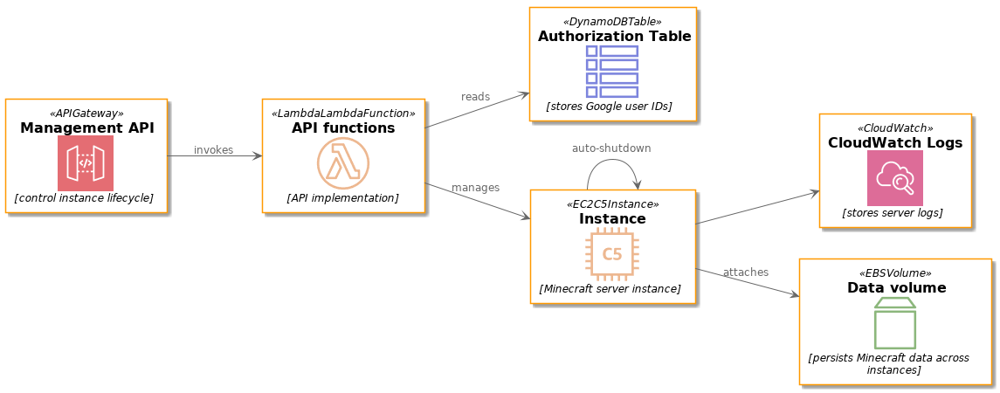

# Elasticraft

Provides an _elastic [Minecraft][] server instance_, using [Amazon EC2][] for the compute capacity, and [Amazon API Gateway][] to provide a management API for the server instance.

## y tho

The use case Elasticraft is designed for is that of a private Minecraft server that is mostly idle over a period of a day.
Typically, a server like this would be hosted either from a home connection (which is not always ideal or feasible), or from always-on (and thus, always-billed) compute capacity, such as a VPS or other cloud instance.
Given the usage pattern where play happens in bursts of activity (after work, or weekends, for example), paying for unused compute capacity is financially inefficient.

Elasticraft provides simple elasticity for this use case, taking advantage of the ["only pay for what you use"][AWS Pricing] nature of cloud pricing.
Using Elasticraft, a server may be started up on-demand, and also supports automatic shutdown when it detects that the Minecraft server has become idle, ensuring the instance doesn't continue racking up hours for nothing.

## How it works



The main entry point for Elasticraft is a REST API hosted on API Gateway, backed by serverless [AWS Lambda][] functions.
Authorisation is done by callers providing a Google JWT, from which the user identity is extracted and checked against a DynamoDB table containing authorised users' identities.
The API functions implement basic state management, but delegate the actual launch data to an [EC2 launch template][], which is configured out-of-band.
Crucially, the launch template contains [user data][EC2 user data] that allows the instance to configure itself without any additional external dependencies or software repositories.
Minecraft server data is stored on a persistent data volume that is dynamically attached to running instances, and detached upon instance termination.

The software components launched on each instance include the Minecraft server (obviously), as well as two helper processes:

* A monitoring daemon that publishes a filesystem usage metric to CloudWatch for the Minecraft data volume, allowing monitoring of the server's disk usage.
* A daemon that detects when the Minecraft server has gone idle, and schedules an automatic shutdown of the instance.
  This scheduled shutdown is cancelled if it detects a subsequent player connection before the shutdown deadline arrives.

## Installing

Word of warning: the CloudFormation template has been continuously tweaked as Elasticraft was developed, so it may not successfully create as a brand new stack.

```
pipenv install -d
make
# Some parameters not specified
aws cloudformation package --template-file cloudformation.yaml --output-template-file cloudformation-packaged.yaml
aws cloudformation create-stack --template-body file://cloudformation-packaged.yaml --capabilities CAPABILITY_AUTO_EXPAND CAPABILITY_IAM
pipenv run python crafting-table vpc
pipenv run python crafting-table launch-template
```

## Source layout

### CloudFormation template

Most resource creation and configuration is delegated to [AWS CloudFormation][], as specified in `cloudformation.yaml`.
The template utilises the [AWS Serverless Application Model][], mostly to ease Lambda function management.

### Configuration scripts

`crafting-table` is a [Click][] application used to finalise configuration of EC2 resources in a way that CloudFormation cannot, or does awkwardly.

When configuring the launch template, it will package `attach-volume`, `cloud-init.sh`, `cloud-init.yaml`, `enderman` and `rs-comparator` into the template's user data field.
In this way, user data is used as an alternative to an external software repository.

### On-instance software

* `attach-volume` is called during instance startup to find and attach the data volume.
* `enderman` is reponsible for monitoring the Minecraft server, and scheduling an automatic shutdown of the instance when it goes idle.
* `rs-comparator` is a background process that publishes metrics on the filesystem usage of the data volume.
* `cloud-init.yaml` is a [cloud-config][] file that assists in configuring the instance.
* `cloud-init.sh` is a [user-data script][] that performs the bulk of the instance configuration on first boot.

### API implementation functions

`server_get.py`, `server_post.py` and `api_authorizer.py` implement the Lambda functions used by API Gateway.
As the names imply, the first two implement `GET` and `POST` request handling for the `/server` resource, while `api_authorizer.py` implements the API authorizer governing access to the API.

### Event handlers

`snapshot_on_shutdown.py` is a Lambda function that is triggered whenever the instance stops, taking a snapshot of the data volume.

`invoke_route53ctl.py` is a Lambda function that is triggered on instance launch and termination, and is reponsible for calling out to an external Lambda function to manage a [Amazon Route 53][] record for the instance. This approach supports the hosted zone existing in an AWS account different to the account hosting the Elasticraft instance.

## License

Elasticraft is made available under the terms of the Apache License 2.0.
See the contents of the LICENSE file for details.

[Amazon API Gateway]: https://aws.amazon.com/api-gateway/
[Amazon EC2]: https://aws.amazon.com/ec2/
[Amazon Route 53]: https://aws.amazon.com/route53/
[AWS CloudFormation]: https://aws.amazon.com/cloudformation/
[AWS Lambda]: https://aws.amazon.com/lambda/
[AWS Pricing]: https://aws.amazon.com/pricing/
[AWS Serverless Application Model]: https://aws.amazon.com/serverless/sam/
[Click]: https://palletsprojects.com/p/click/
[cloud-config]: https://cloudinit.readthedocs.io/en/latest/topics/format.html#cloud-config-data
[EC2 launch template]: https://docs.aws.amazon.com/AWSEC2/latest/UserGuide/ec2-launch-templates.html
[EC2 user data]: https://docs.aws.amazon.com/AWSEC2/latest/UserGuide/user-data.html
[Minecraft]: https://minecraft.net/
[user-data script]: https://cloudinit.readthedocs.io/en/latest/topics/format.html#user-data-script
